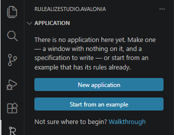
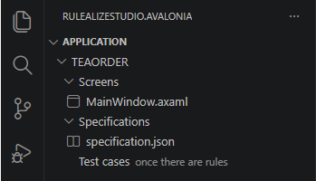
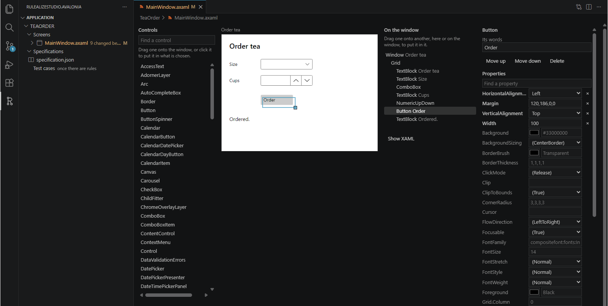
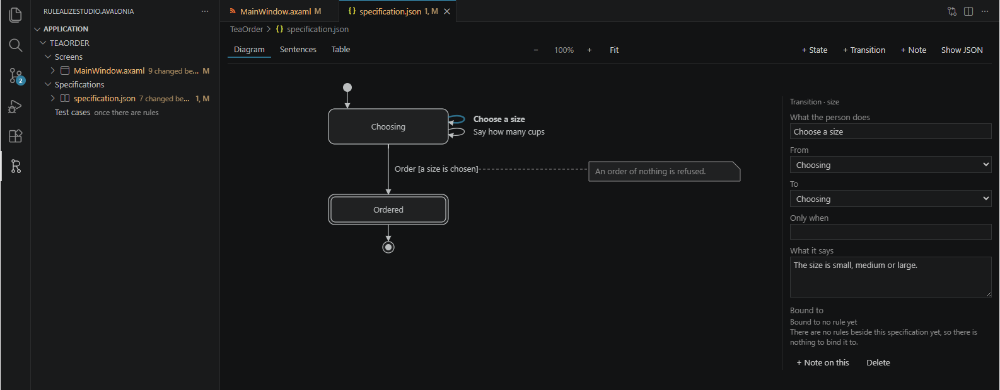
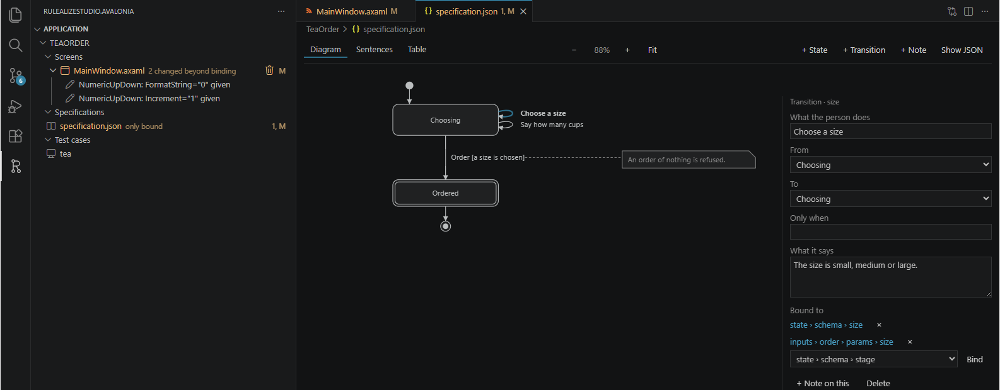
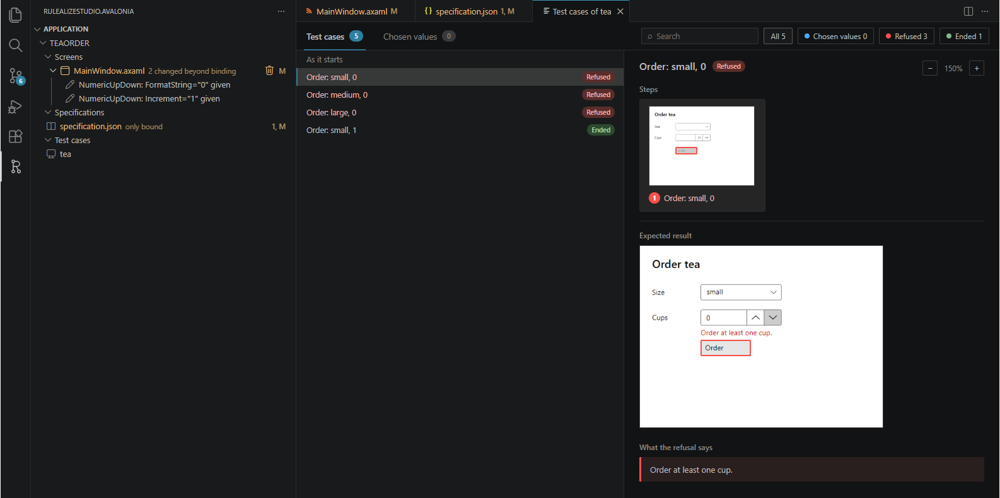
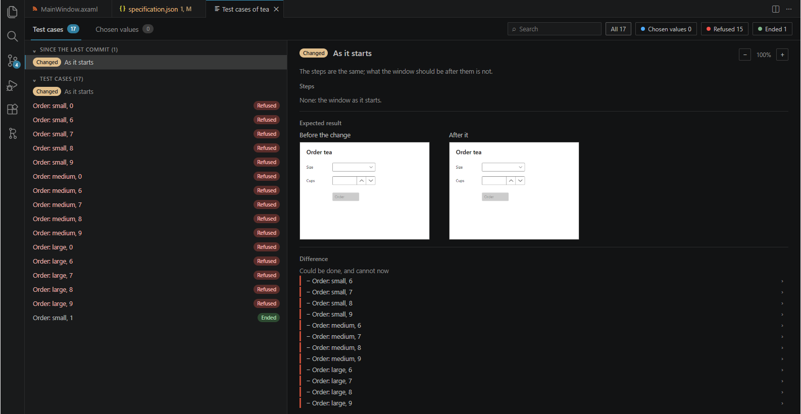

# Building an application this way

From an empty folder to an application that does what you meant, in about half an hour. You make
its screen and write what it should do; an agent writes the rules from them; you read on the
application's own window everything the rules allow, ask for changes until it is what you meant,
and keep each version you agree with. You read no JSON and no XAML.

Each step says what to do, then **you see** what should be in front of you when it is done. Where
you see something else, that is worth writing down.

## Before you start

- VS Code, with RulealizeStudio.Avalonia installed — from **Extensions**, searching for it — and
  git.
- An agent that can work in a folder on this computer — Claude Code, say — signed in.
- A small application you want: one window, two or three things somebody does on it, and what
  should not be allowed. For example: *order tea — choose a size, one to five cups, and order; an
  order of nothing is refused*.

## 1. Open an empty folder — 1 minute

**File → Open Folder…**, an empty folder, then the RulealizeStudio.Avalonia icon in the activity
bar on the left.

**You see** the view say there is no application here yet, with **New application**, **Start from
an example** and **Walkthrough** under it.

## 2. Make the application — 3 minutes

**New application**, and a name for it in letters, such as **TeaOrder**. The first time, you are
asked to fetch the .NET SDK: **Fetch**, and wait.

**You see** in the view, under the application's name: **Screens** with `MainWindow.axaml` under
it, **Specifications** with `specification.json`, and **Test cases**, saying *once there are rules*. In the Explorer there is a folder of that name.

## 3. Keep it — 1 minute

**Source Control** in the activity bar, **Initialize Repository**, a message such as *made*, and
**Commit**. Say yes to committing all the changes.

**You see** nothing left under Changes in Source Control. Every change from now on is read against
what you last committed.

## 4. Design the screen — 8 minutes

**MainWindow.axaml**, under **Screens** in the view.

**You see** the application's window, empty, with **Controls** beside it, and **On the window**
under them.

Drag what you want onto the window, to where you want it — a **TextBlock** for something said, a
**ComboBox** for a choice, a **NumericUpDown** or a **TextBox** for something typed, a **Button**
for something done. **Find a control** finds one by its name. Drag one on the window to move it, and
the square at its bottom right corner to change its size. Choose one, on the window or under **On
the window**, to write what it says on the window in **Its words** — *Order* on a button, say — or
**Delete** it, and under **Properties** to change anything else of it — its colours, its font, its
size, its alignment; choose the window itself for its size, its title and its background. Write the
words in your own language.

**You see** the window change within a second of each change, as it will look: each control where
you let go of it, at the size you gave it.

Every property under **Properties** is Avalonia's: the control's own, those it inherits, and those
what holds it lends it, written with that one's name first — **Grid.Row**. What each does is
Avalonia's to say. [Controls](https://docs.avaloniaui.net/controls) explains each control and the
properties it is mostly given, and [Positioning controls](https://docs.avaloniaui.net/docs/layout/positioning-controls)
its alignment, margin and padding. Every property, each with a sentence, is on the control's page of
[Avalonia's API reference](https://api-docs.avaloniaui.net/), found by its name in the search there;
one lent by what holds it is on that one's page, among its fields — **Grid.Row** as **RowProperty**
on **Grid**'s.

Another window — one that asks *Order these?*, say — is the + on **Screens** in the view — it
shows where the pointer is on that line — and a name; a window is deleted with the bin on its line. It opens beside the first, empty, and is designed the same way. When it
appears and when it goes, its × included, is not set here: say it in the specification in step 5,
and the agent binds it to the rules.

## 5. Write what it should do — 8 minutes

**specification.json**, under **Specifications** in the view.

**You see** **Diagram**, **Sentences** and **Table**, and *Nothing is specified yet*.

- **+ State** for where the application is: give it a **Name** and say what is true there in **What
  it says**. The first is **It starts here**; one where it is finished is **It ends here**.
- On a state, **+ Transition from here** for what the person does there: **What the person does**,
  **To** where it leads (the same state where it stays), and **Only when**, in words, if it is
  allowed only sometimes.
- **+ Note on this** for what is said about it that is not a move — above all what is refused:
  *an order of nothing is refused*.

Write it as you would say it. Read it back under **Sentences**. In the **Diagram**, choose a
transition by its name; Ctrl and the wheel, or a pinch on a touchpad, zoom it, and dragging where
nothing is moves it.

**You see** each state and transition in the diagram and each read as a sentence; any one chosen
says *Bound to no rule yet*.

## 6. Keep it — 1 minute

In Source Control, a message such as *screen and specification*, and **Commit**.

## 7. Ask for the rules — 5 minutes

Start your agent in the application's folder — for Claude Code, **Terminal → New Terminal**, then
`cd TeaOrder` and `claude` — and ask in your own words, for example: *write the rules of this
application from specification.json and MainWindow.axaml, bind the screen to them, and derive the
test design*. Answer what it asks to run as you would at home. The folder tells it what is in it
and which tools it has.

**You see**, once it has finished:

- **Test cases** in the view no longer says *once there are rules*, and has the rules' name
  under it.
- Under **specification.json** and **MainWindow.axaml**, *only bound*, or *n changed beyond binding* with each
  change on a line of its own below it. Expect a few on the screen that binding it needed — how a
  box shows a number, say.
  Anything else listed — a state reworded, a control taken out — is the agent changing what you
  made; ask it why, or to put it back.
- Opening the specification, each element is now bound to rules. A rule marked *not in the rules*,
  or a problem in the Problems panel, is a disagreement between your specification and the rules:
  tell the agent.
- One warning there is nothing to worry about: *Unable to load schema*, on the specification or on
  any other file of the application VS Code has open. The top of each file names what kind of file
  it is, and VS Code reads that name as a place to fetch a description of the file from. There is
  nothing to fetch, so it says so. Nothing is wrong with the file, and you can leave the warning
  where it is.

## 8. Read its test cases — 5 minutes

The rules' name under **Test cases**, in the view. The first time, the application is built.

**You see** two tabs, **Test cases** and **Chosen values**. Under **Test cases**, every test case of
the application, fewest steps first: each is the steps to take from where it starts, said as its
window says them, and what its window should be after them; each value the rules refuse is a test
case of its own, in red and marked **Refused**. **Search** and **All**, **Chosen values**,
**Refused** and **Ended** narrow the list. Choose one, and you see its **Steps**, each the window it
is taken on with the control to press marked, and its **Expected result**: the window as it should
stand, the **Next operations** with where each leads, and the **Refused operations** with what each
says; for a value refused, the window as it says the refusal, and **What the refusal says**. **−**
and **+** at the top right draw the windows smaller or larger, and a window clicked opens larger.

Where something is typed, the rules cannot list every value. Under **Chosen values**, **Add** one:
the situation, the operation and the value, and it is read as the rest is. Each one chosen is listed
there with whether the rules take it.

Look for what you did not mean: something possible that should not be, something you cannot reach,
a refusal missing or worded wrong.

Before asking for a change, commit what the agent made, in Source Control as in step 6, even where
it is not yet what you meant: what a change did is read against what you last committed.

## 9. Ask for a change, and read what it did — 5 minutes a change

Tell the agent what you saw and what you meant instead, in your own words, at the situation where
you saw it: *after choosing a size, ordering six cups should be refused*.

**You see** *Since the last commit*, with how many, at the top of the test cases: every test case
the change touched, marked **Changed**, **Added** or **Removed**. Choose one, and its expected result
**Before the change** and **After it** stand side by side, with the **Difference** listed below:
what can be done now and could not, what is refused now, and the rest. In the list below them, a
test case the change touched is marked too, and **Compare with before the change** shows it so.
Either list folds away by its heading, and opens again. Under **specification.json** and **MainWindow.axaml** in
the view, what changed of them beyond binding them, as in step 7.

It stays there until you commit, whether or not the agent derived the test design again. Where the
change is not what you meant, ask again; to throw it away, ask the agent to, or **Discard Changes**
in Source Control.

## 10. Keep what you meant — 1 minute

When it is what you meant, commit it in Source Control.

**You see** *Since the last commit* gone from the top of the test cases, and nothing under **specification.json**
and **MainWindow.axaml** in the view: what you have is what you last committed. Go back to step 8 for the
next thing you see.

## 11. Use it

Ask the agent to start the application, or `dotnet run` in its folder in the terminal.

**You see** the window you read in step 8, doing what the rules allow and refusing what they refuse:
its controls say what you wrote in **Its words** in step 4, and each refusal says what you read under
**What the refusal says** in step 8.
